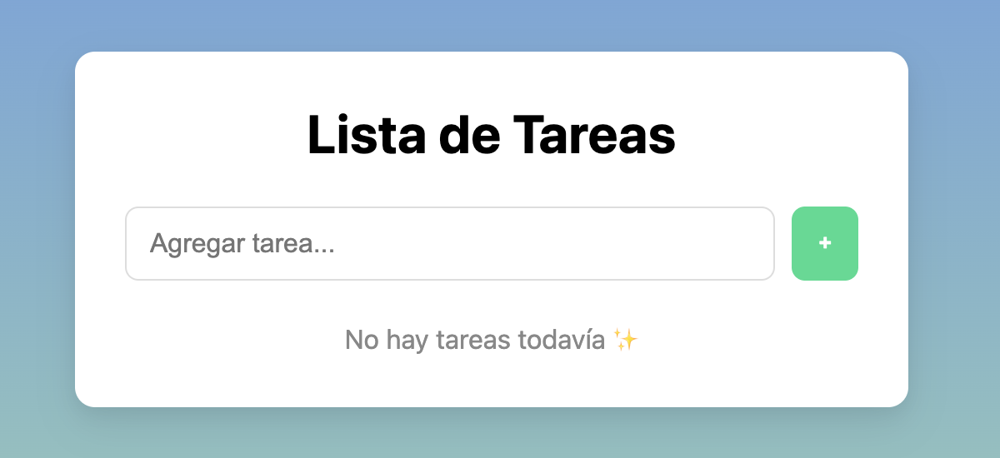
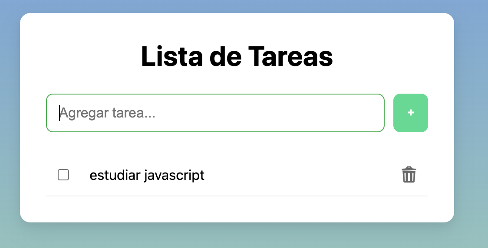
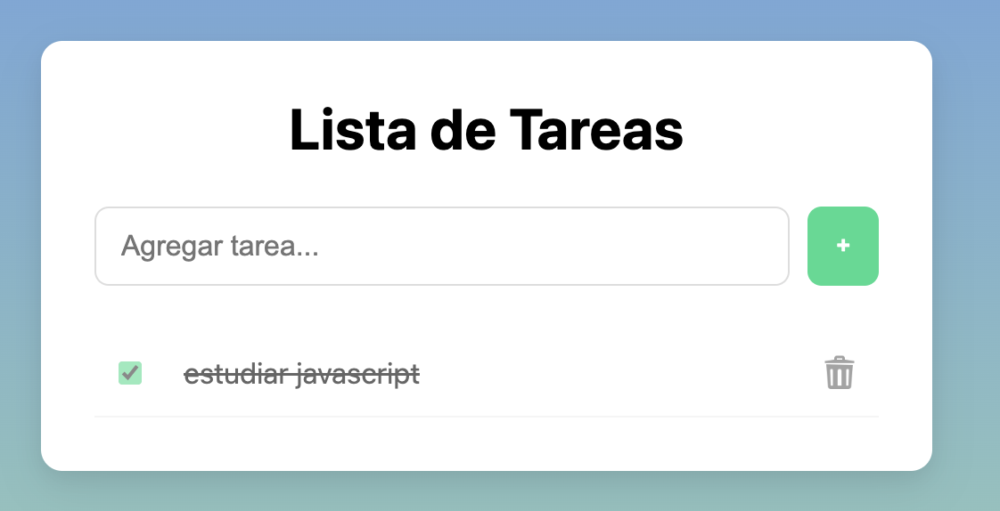

# TaskApp

# 📝 TaskApp

Una aplicación simple de **lista de tareas (Todo List)** construida con **HTML, CSS y JavaScript puro**, que permite agregar, completar y eliminar tareas.
Las tareas se guardan en **LocalStorage**, por lo que permanecen disponibles incluso después de recargar la página.

Este proyecto fue creado como práctica para trabajar con **manipulación del DOM, eventos, almacenamiento local y organización básica de un proyecto frontend**.

---

## ✨ Features

- ➕ Agregar nuevas tareas
- ✔️ Marcar tareas como completadas
- 🗑 Eliminar tareas
- 💾 Persistencia usando **LocalStorage**
- ⌨️ Agregar tareas presionando **Enter**
- 📱 Interfaz simple y responsive
- 🎨 Estilo moderno con layout tipo _card_

---

## 🖼 Preview

- Inicio  
  

-  Agregar tarea
  

- Marcar como completada   
  

---

## Live Demo

[Demo App](https://ali-zunega.github.io/TaskApp/)

---

## 🛠 Tecnologías utilizadas

- **HTML5**
- **CSS3**
- **JavaScript (ES6 modules)**
- **LocalStorage API**

---

## 📂 Estructura del proyecto

```
taskapp
│
├── index.html
│
├── css
│   ├── reset.css
│   └── styles.css
│
├── js
│   ├── app.js
│   ├── storage.js
│   ├── service.js
│   └── ui.js
│
├── assets
│
└── README.md
```

---

## ⚙️ Cómo ejecutar el proyecto

1. Clonar el repositorio

```
git clone https://github.com/ali-zunega/TaskApp.git
```

2. Entrar al proyecto

```
cd taskapp
```

3. Abrir `index.html` en el navegador
   o usar una extensión como **Live Server** en VSCode.

---

## 📚 Conceptos practicados

- Manipulación del **DOM**
- Manejo de **eventos**
- Uso de **LocalStorage**
- Separación de responsabilidades en JavaScript
- Organización básica de un proyecto frontend
- Diseño de interfaces simples y responsivas

---

## 🚀 Posibles mejoras futuras

- Filtros de tareas (**All / Active / Completed**)
- Contador de tareas pendientes
- Botón para eliminar tareas completadas
- Animaciones al agregar o eliminar tareas
- Modo oscuro

---

## 📄 Licencia

Este proyecto fue creado con fines educativos.
